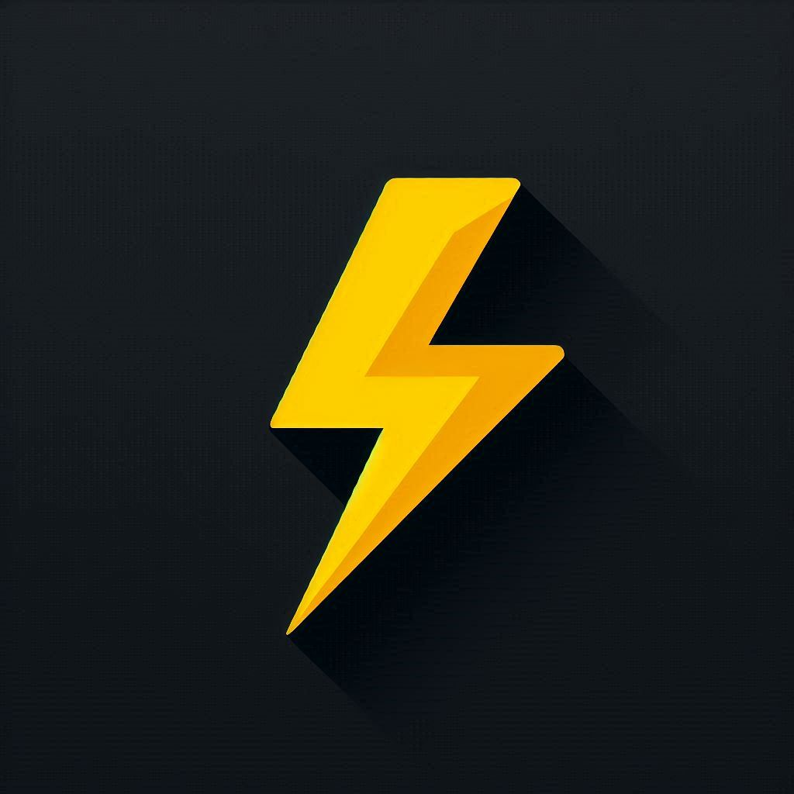

<a id="readme-top"></a>

<!-- PROJECT LOGO -->
<br />
<div align="center">
  <a href="https://github.com/younes101020/electra-v2">
    
  </a>

  <h3 align="center">Electra</h3>

  <p align="center">
    The first meeting platform for film lovers
    <br />
  </p>
</div>

<!-- TABLE OF CONTENTS -->
<details>
  <summary>Table of Contents</summary>
  <ol>
    <li>
      <a href="#about-the-project">About The Project</a>
      <ul>
        <li><a href="#sequence-diagram">Sequence diagram</a></li>
        <li><a href="#built-with">Built With</a></li>
      </ul>
    </li>
    <li>
      <a href="#getting-started">Getting Started</a>
      <ul>
        <li><a href="#prerequisites">Prerequisites</a></li>
        <li><a href="#installation">Installation</a></li>
      </ul>
    </li>
    <li><a href="#roadmap">Roadmap</a></li>
    <li><a href="#contributing">Contributing</a></li>
    <li><a href="#license">License</a></li>
    <li><a href="#contact">Contact</a></li>
  </ol>
</details>

<!-- ABOUT THE PROJECT -->

## About The Project

I wanted to create an application that would allow movie lovers to meet up and chat about their favorite films or series, and now it's done with Electra.

Quick tour of the application's flagship features

- Chat with people who like the same movies as you using Space
- Add movies to your favorites list
- Rate the listed films in order to improve their referencing

<p align="right">(<a href="#readme-top">back to top</a>)</p>

### Sequence diagram

Electra extends a huge functionality from TMDB, that's why you will need a TMDB account to use the application. Here is a sequence diagram for the authentication process used within the application:

[![Authentication sequence diagram][sequence-diagram]](https://developer.themoviedb.org/reference/authentication-how-do-i-generate-a-session-id)

<p align="right">(<a href="#readme-top">back to top</a>)</p>

### Built With

- [![Next][Next.js]][Next-url]
- [![Socketio][Socket.io]][Socket-io]
- [![React Query][React-Query]][React-Query]
- [![Prisma][Prisma]][Prisma]
- [![TailwindCSS][TailwindCSS]][TailwindCSS]
- [![Yarn][Yarn]][Yarn]
- [![Nodemon][Nodemon]][Nodemon]
- [![Context-API][Context-API]][Context-API]
- [![Postgres][Postgres]][Postgres]

<p align="right">(<a href="#readme-top">back to top</a>)</p>

<!-- GETTING STARTED -->

## Getting Started

This is an example of how you may give instructions on setting up your project locally.
To get a local copy up and running follow these simple example steps.

### Prerequisites (dev)

- Docker-compose
- Yarn
- NodeJS

### Installation (dev)

1. Get a free TMDB api key and access token by following this [TMDB Documentation](https://developer.themoviedb.org/docs/getting-started)
2. Clone the repo
   ```sh
   git clone https://github.com/younes101020/electra-v2.git
   ```
3. Install NPM packages
   ```sh
   yarn install
   ```
4. Create `.env.development` file in root path and copy the content of `.env.example` into it, make sure to fill empty variables with your credentials
   ```bash
   TMDB_API_KEY=""
   TMDB_ACCESS_TOKEN=""
   NEXT_PUBLIC_BASEURL="http://localhost:3000"
   BASETMDBURL="https://api.themoviedb.org/3"
   DATABASE_URL=""
   JWT_SECRET_KEY=""
   ```
5. Initially your database should be empty you have to use this command to apply electra migrations into it:

   ```sh
   yarn migrate:deployondev
   ```

<p align="right">(<a href="#readme-top">back to top</a>)</p>

<!-- ROADMAP -->

## Roadmap

- [x] Database modeling into prisma schema
- [x] Setup auth with extending tmdb auth
- [x] moove auth checking from layout to middleware
- [x] Perform full text show research
- [x] Init text lounge <em>Space</em> on first click for each entity
- [ ] add movie page and display all related movie entity like actors..., we should be able to rate the movie from this page
- [ ] Automate the creation of specialized ai for each <em>Space</em>, the ia must be able to answer all questions relating to the current show (more ai related feature should come in the future)
- [ ] Multi-language Support
  - [ ] English (urgent)
  - [x] French

See the [open issues](https://github.com/othneildrew/Best-README-Template/issues) for a full list of proposed features (and known issues).

<p align="right">(<a href="#readme-top">back to top</a>)</p>

<!-- CONTRIBUTING -->

## Contributing

Contributions are what make the open source community such an amazing place to learn, inspire, and create. Any contributions you make are **greatly appreciated**.

If you have a suggestion that would make this better, please fork the repo and create a pull request. You can also simply open an issue with the tag "enhancement".
Don't forget to give the project a star! Thanks again!

1. Fork the Project
2. Create your Feature Branch (`git checkout -b feature/AmazingFeature`)
3. Commit your Changes (`git commit -m 'Add some AmazingFeature'`)
4. Push to the Branch (`git push origin feature/AmazingFeature`)
5. Open a Pull Request

<p align="right">(<a href="#readme-top">back to top</a>)</p>

<!-- LICENSE -->

## License

Distributed under the MIT License. See `LICENSE.txt` for more information.

<p align="right">(<a href="#readme-top">back to top</a>)</p>

<!-- CONTACT -->

## Contact

Younes Fakallah - [@untilsw](https://twitter.com/untilsw)

<p align="right">(<a href="#readme-top">back to top</a>)</p>

<!-- MARKDOWN LINKS & IMAGES -->
<!-- https://www.markdownguide.org/basic-syntax/#reference-style-links -->

[contributors-shield]: https://img.shields.io/github/contributors/othneildrew/Best-README-Template.svg?style=for-the-badge
[contributors-url]: https://github.com/othneildrew/Best-README-Template/graphs/contributors
[forks-shield]: https://img.shields.io/github/forks/othneildrew/Best-README-Template.svg?style=for-the-badge
[forks-url]: https://github.com/othneildrew/Best-README-Template/network/members
[stars-shield]: https://img.shields.io/github/stars/othneildrew/Best-README-Template.svg?style=for-the-badge
[stars-url]: https://github.com/othneildrew/Best-README-Template/stargazers
[issues-shield]: https://img.shields.io/github/issues/othneildrew/Best-README-Template.svg?style=for-the-badge
[issues-url]: https://github.com/othneildrew/Best-README-Template/issues
[license-shield]: https://img.shields.io/github/license/othneildrew/Best-README-Template.svg?style=for-the-badge
[license-url]: https://github.com/othneildrew/Best-README-Template/blob/master/LICENSE.txt
[linkedin-shield]: https://img.shields.io/badge/-LinkedIn-black.svg?style=for-the-badge&logo=linkedin&colorB=555
[linkedin-url]: https://linkedin.com/in/othneildrew
[sequence-diagram]: public/img/auth-sequence-diagram.png
[Next.js]: https://img.shields.io/badge/next.js-000000?style=for-the-badge&logo=nextdotjs&logoColor=white
[Socket.io]: https://img.shields.io/badge/Socket.io-black?style=for-the-badge&logo=socket.io&badgeColor=010101
[Prisma]: https://img.shields.io/badge/Prisma-3982CE?style=for-the-badge&logo=Prisma&logoColor=white
[Yarn]: https://img.shields.io/badge/yarn-%232C8EBB.svg?style=for-the-badge&logo=yarn&logoColor=white
[Next-url]: https://nextjs.org/
[Context-API]: https://img.shields.io/badge/Context--Api-000000?style=for-the-badge&logo=react
[Nodemon]: https://img.shields.io/badge/NODEMON-%23323330.svg?style=for-the-badge&logo=nodemon&logoColor=%BBDEAD
[TailwindCSS]: https://img.shields.io/badge/tailwindcss-%2338B2AC.svg?style=for-the-badge&logo=tailwind-css&logoColor=white
[React-Query]: https://img.shields.io/badge/-React%20Query-FF4154?style=for-the-badge&logo=react%20query&logoColor=white
[React-url]: https://reactjs.org/
[Postgres]: https://img.shields.io/badge/postgres-%23316192.svg?style=for-the-badge&logo=postgresql&logoColor=white
